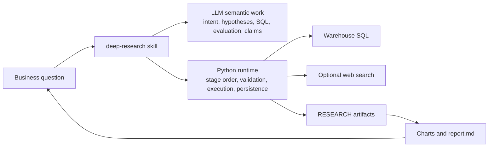
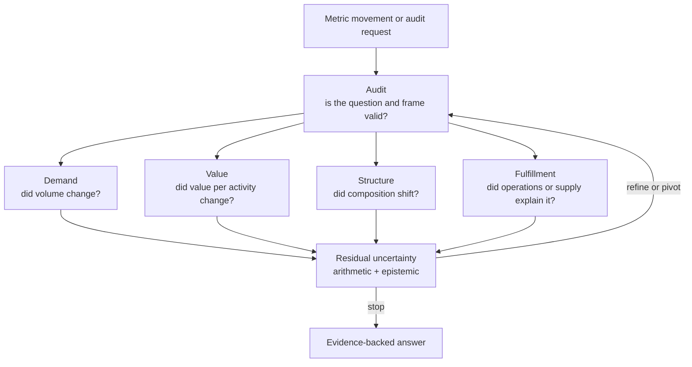
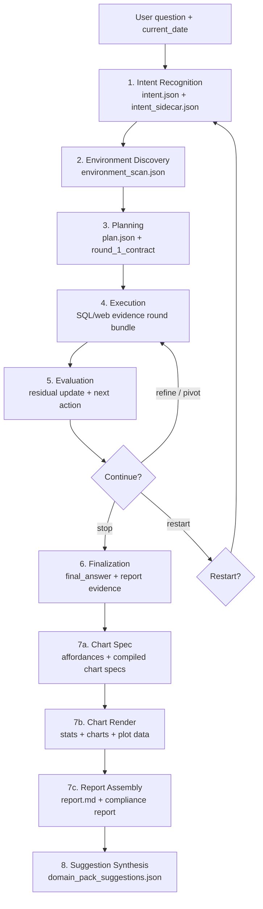
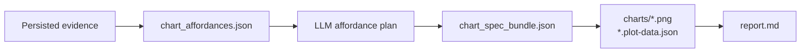

# Pandora: Deep Research Skill Family

[中文版](README.zh-CN.md)

Pandora is a contract-first research runtime for LLM-driven business analysis.
It is built for questions such as:

- Why did this metric change?
- Which segment contributed most to the movement?
- Is this operational trend real, or is it a reporting artifact?
- Do we have enough warehouse and web evidence to answer this safely?

The project combines a user-facing `deep-research` skill, strict stage
contracts, a Python runtime, SQL/web evidence execution, visualization
generation, and auditable report assembly.



## What Pandora Is

Pandora separates business reasoning from runtime enforcement.

| Owner | Responsibilities |
| --- | --- |
| LLM / skill protocol | Business semantics, hypothesis design, SQL authorship, web-search questions, evaluation reasoning, final claims. |
| Runtime | Stage order, contract validation, SQL and web execution, cache/admission policy, artifact persistence, lineage checks, compliance reports. |
| Host application | Warehouse client factories, optional web provider, model callbacks, report policy, scheduling or product integration. |

The runtime never chooses tables, joins, filters, metrics, hypotheses, chart
semantics, or final claims for the model. It only executes and validates
explicit artifacts that the protocol produced.

## Why It Exists

Freeform data-analysis agents often fail in predictable ways: they jump to
driver claims before validating the metric, rewrite SQL silently, lose lineage,
or turn partial evidence into confident conclusions. Pandora constrains that
workflow with explicit contracts and persisted evidence.



## Repository Map

```text
Pandora-main/
  README.md
  README.zh-CN.md
  requirements.txt
  scripts/
    deep_research_runtime.py        # Bridge CLI for local agents and hosts.
    example_sql_boundary_test.py    # Example warehouse boundary tester.
  runtime/
    contracts.py                    # Shared object validation.
    session_state.py                # Stage order and continuation gates.
    session_orchestration.py         # End-to-end governed session helpers.
    orchestration.py                # Contract execution and finalization.
    tools.py                        # SQL execution helpers.
    web_search.py                   # Provider-neutral web evidence lane.
    visualization.py                # Chart affordances, rendering, report assembly.
    compliance.py                   # Protocol trace, evidence graph, audit report.
    example_clients/                # Vendor HTTP, generic HTTP, SQLAlchemy clients.
  skills/
    deep-research/SKILL.md          # Official user-facing entrypoint.
    intent-recognition/SKILL.md     # Stage 1.
    data-discovery/SKILL.md         # Stage 2.
    data-visualization/SKILL.md     # Stage 7.
  tests/
    test_visualization_affordances.py
    test_web_evidence_runtime.py
```

## Execution Lifecycle

The protocol is serial. Stages must not be skipped, reordered, or merged into a
freeform answer.



### Stage Responsibilities

| Stage | Role | Produces |
| --- | --- | --- |
| 1. Intent Recognition | Normalize the raw question into a safe research frame. | `IntentRecognitionResult`, frozen `NormalizedIntent`, `pack_gaps`. |
| 2. Environment Discovery | Inspect schema and evidence availability without promoting claims. | `DataContextBundle`. |
| 3. Planning | Build the hypothesis board and author the first executable contract. | `PlanBundle`, `round_1_contract`. |
| 4. Execution | Execute only explicit `queries[]` and `web_searches[]`. | SQL results, web results, recall assessments, execution log, round bundle. |
| 5. Evaluation | Interpret persisted evidence and decide `refine`, `pivot`, `stop`, or `restart`. | `RoundEvaluationResult`, continuation token when needed. |
| 6. Finalization | Synthesize supported claims and report evidence. | `FinalAnswer`, `ReportEvidenceBundle`, `ReportEvidenceIndex`. |
| 7a. Chart Spec | Let runtime expose chart-ready affordances; let LLM select affordance ids. | `chart_affordances.json`, `chart_compile_report.json`, `chart_spec_bundle.json`. |
| 7b. Chart Render | Render charts from explicit plot data and plot specs. | `descriptive_stats.json`, `visualization_manifest.json`, `charts/*`. |
| 7c. Report Assembly | Package the human-readable markdown report. | `report.md`, refreshed `compliance_report.json`. |
| 8. Suggestion Synthesis | Propose best-effort domain-pack improvements. | `domain_pack_suggestions.json` when useful. |

## Quick Start

Pandora is mostly stdlib Python. Optional render and warehouse dependencies are
listed in `requirements.txt`.

```bash
python3 -m venv .venv
source .venv/bin/activate
python3 -m pip install -r requirements.txt
```

Verify local runtime wiring:

```bash
python3 scripts/deep_research_runtime.py doctor
```

Inspect runtime capabilities:

```bash
python3 scripts/deep_research_runtime.py capabilities
```

Create a session shell:

```bash
python3 scripts/deep_research_runtime.py start-session \
  --slug demo_research \
  --raw-question "Why did weekly revenue decline?" \
  --current-date "2026-05-07" \
  --web-search-mode skip
```

From there, a host or local agent persists each stage artifact through the
bridge CLI:

```bash
python3 scripts/deep_research_runtime.py persist-intent \
  --slug demo_research \
  --session-id <session_id> \
  --input intent_result.json

python3 scripts/deep_research_runtime.py persist-discovery \
  --slug demo_research \
  --session-id <session_id> \
  --input discovery_bundle.json

python3 scripts/deep_research_runtime.py persist-plan \
  --slug demo_research \
  --session-id <session_id> \
  --input plan_bundle.json
```

`run_research_session(...)` in `runtime/session_orchestration.py` is the
programmatic host integration API. It expects host-provided `produce_*`
callbacks; it is not a standalone autonomous LLM runner.

## Connect A Warehouse

The CLI accepts registered factory aliases only. This prevents LLM-authored
content from passing arbitrary module paths or filesystem paths.

Built-in aliases:

| Alias | Implementation |
| --- | --- |
| `vendor_http` | `runtime.example_clients.vendor_http_client:create_client` |
| `http` | `runtime.example_clients.http_sql_client:HttpSqlClient` |
| `sqlalchemy` | `runtime.example_clients.http_sql_client:SqlAlchemyClient` |

Register custom trusted factories from the host environment:

```bash
export DEEP_RESEARCH_CLIENT_FACTORIES='{"warehouse":"my_package.clients:create_client"}'
```

Then execute discovery or contracts through the alias:

```bash
python3 scripts/deep_research_runtime.py probe-schema \
  --client-factory warehouse \
  --list-tables-sql "SHOW TABLES"
```

### Vendor HTTP Example

```bash
export VENDOR_WAREHOUSE_BASE_URL="https://<warehouse-host>"
export VENDOR_WAREHOUSE_PATH="/<sql-endpoint>"
export VENDOR_WAREHOUSE_CHANNEL="<channel-or-app-id>"
export VENDOR_WAREHOUSE_SECRET="<request-signing-secret>"
export VENDOR_WAREHOUSE_QUERY_TIMEOUT="60"
export VENDOR_WAREHOUSE_MAX_ROWS="200000"
```

## Web Evidence Lane

Pandora supports SQL-only sessions and mixed SQL/web evidence sessions.

The default web provider is Tavily when configured:

```bash
export TAVILY_API_KEY="<secret>"
```

Useful modes:

| Mode | Behavior |
| --- | --- |
| `auto` | Use a configured provider when available; continue SQL-only otherwise. |
| `required` | Fail preflight if no web provider is configured. |
| `skip` | Disable web search for the session. |

Hosts can register custom web clients with `DEEP_RESEARCH_WEB_CLIENT_FACTORIES`.

## Visualization And Reports

Stage 7 is governed so charts cannot invent new analysis. Runtime first builds
chart-ready affordances from persisted evidence, the LLM selects affordance ids,
then runtime compiles and renders explicit plot data.



Common bridge commands:

```bash
python3 scripts/deep_research_runtime.py prepare-chart-affordances \
  --slug demo_research \
  --session-id <session_id>

python3 scripts/deep_research_runtime.py compile-chart-spec \
  --slug demo_research \
  --session-id <session_id> \
  --input chart_affordance_plan.json

python3 scripts/deep_research_runtime.py render-charts \
  --slug demo_research \
  --session-id <session_id>

python3 scripts/deep_research_runtime.py assemble-report \
  --slug demo_research \
  --session-id <session_id>
```

Renderer capability can be checked with `doctor` or `capabilities`. The current
runtime exposes a Matplotlib/Agg renderer, explicit plot data requirements, and
line, bar, horizontal bar, scatter, area, histogram, box, and heatmap support.

## Artifacts

Each session writes auditable artifacts under:

```text
RESEARCH/<slug>/
  latest_session.json
  sessions/
    <session_id>/
      manifest.json
      session_state.json
      intent.json
      intent_sidecar.json
      environment_scan.json
      plan.json
      rounds/
        <generation_id>/
          <round_id>.json
      execution_log.json
      final_answer.json
      report_evidence.json
      report_evidence_index.json
      chart_affordances.json
      chart_compile_report.json
      chart_spec_bundle.json
      descriptive_stats.json
      visualization_manifest.json
      charts/*.plot-data.json
      charts/*.png
      report.md
      protocol_trace.json
      evidence_graph.json
      compliance_report.json
      domain_pack_suggestions.json
```

Use `load_session_evidence(slug)` or the bridge command below when a consumer
needs the complete persisted context:

```bash
python3 scripts/deep_research_runtime.py session-evidence \
  --slug demo_research \
  --session-id <session_id>
```

## Domain Packs

Domain packs are the context-specific layer for vocabulary and priors. They can
tune metric aliases, dimensions, problem-type hints, hypothesis-family priors,
operator preferences, and performance-risk hints.

They cannot replace discovery, expose physical schema shortcuts to Stage 1, or
remove the requirement that executable SQL is authored explicitly by the LLM.

Start with:

- `skills/deep-research/domain-packs/DOMAIN_PACK_GUIDE.md`
- `skills/deep-research/domain-packs/generic/pack.json`

## Example SQL Safety Notes

The repository includes Example warehouse boundary notes:

- `example_sql_boundary_report.md`
- `example_sql_writing_rules.md`
- `skills/deep-research/references/example-sql-rules.md`

When a session touches Example warehouse data, the skill protocol requires
loading the Example SQL rules before probing or executing SQL.

High-level rules:

- Use a single `SELECT` or `WITH` statement.
- Add `LIMIT` for exploratory samples.
- Filter fact-table queries by time, especially `example_fact.event_time`.
- Avoid unfiltered high-cardinality aggregation, large sorts, and stacked
  `COUNT(DISTINCT ...)`.
- Filter or aggregate the fact side before joining dimensions.

## Development

Run the test suite:

```bash
python3 -m unittest discover -s tests -v
```

Useful smoke checks:

```bash
python3 scripts/deep_research_runtime.py doctor
python3 scripts/deep_research_runtime.py capabilities
```

The current tests cover governed chart affordance compilation, text-only report
fallbacks, web evidence execution, recall refinement, and SQL/web lineage
validation.

## Canonical Documents

| Document | Purpose |
| --- | --- |
| `skills/deep-research/SKILL.md` | Official user-facing protocol entrypoint. |
| `skills/deep-research/references/contracts.md` | Cross-stage object source of truth. |
| `skills/deep-research/references/core-methodology.md` | Five-layer methodology, residual logic, and conclusion discipline. |
| `skills/intent-recognition/SKILL.md` | Stage 1 intent normalization. |
| `skills/data-discovery/SKILL.md` | Stage 2 discovery. |
| `skills/deep-research/sub-skills/hypothesis-engine.md` | Stage 3 planning. |
| `skills/deep-research/sub-skills/investigation-evaluator.md` | Stage 5 evaluation. |
| `skills/data-visualization/SKILL.md` | Stage 7 visualization and report packaging. |

## Non-Negotiable Rules

1. Use `deep-research` as the full-session entrypoint.
2. Treat `contracts.md` as the source of truth for shared object shapes.
3. Freeze `NormalizedIntent` once Stage 2 begins.
4. Keep Stage 2 discovery-only.
5. Make Round 1 audit-first.
6. Execute only explicit `InvestigationContract.queries[]` and `web_searches[]`.
7. Continue only when the latest evaluation identifies a better next test.
8. Preserve contradictions and residual uncertainty.
9. Trace every supported final claim to persisted evidence.
10. Do not use visualization or report assembly to introduce new claims.
