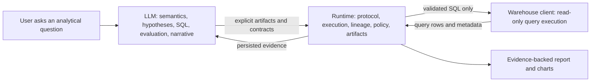
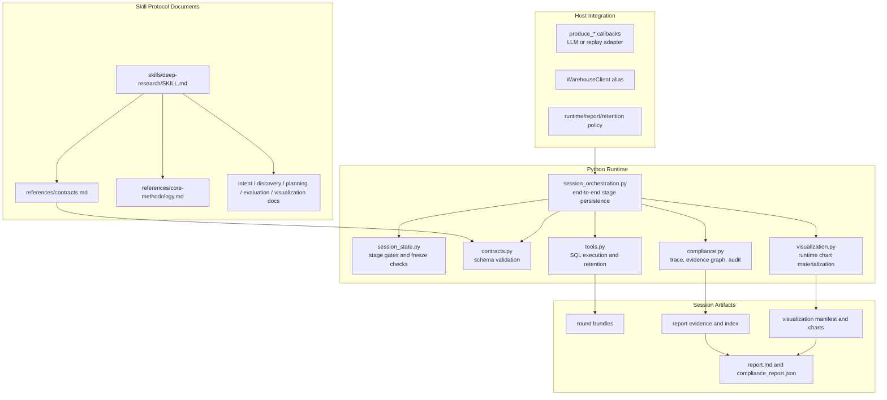
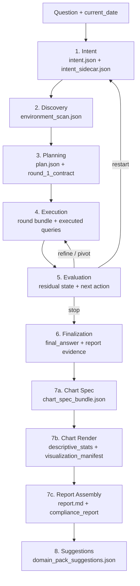
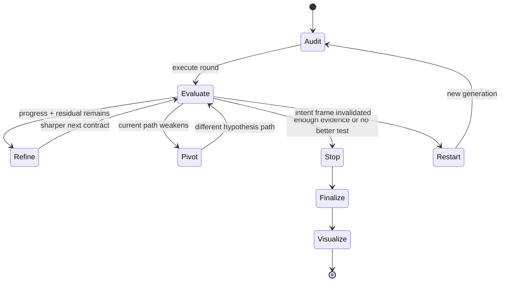
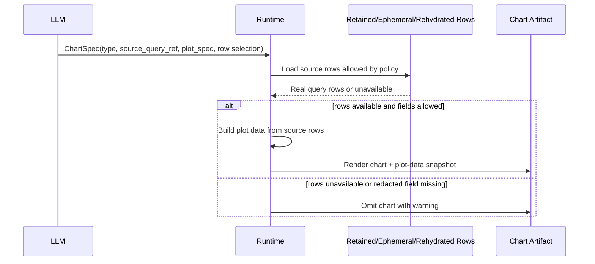
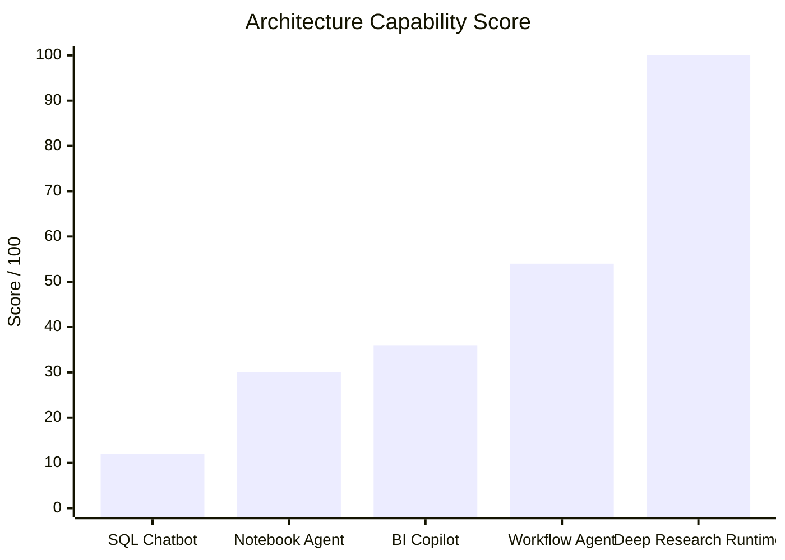
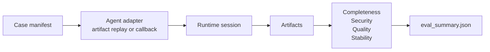

# Deep Research Runtime

Contract-first runtime for evidence-backed data analysis.

Deep Research Runtime is a protocol layer for long-running analytical agents. It
helps an LLM investigate questions such as "why did this metric move?", "which
segment drove the change?", or "is this trend real?" without turning the
runtime into a hidden decision-maker.

The project splits responsibility cleanly:

- The LLM owns business semantics, hypothesis design, SQL authorship,
  evaluation reasoning, chart intent, and final conclusions.
- The runtime owns stage order, contract validation, SQL execution, row
  retention policy, artifact persistence, lineage checks, restart handling,
  chart materialization, and compliance output.
- Host systems own warehouse credentials, client adapters, live-mode approval,
  retention policy, report policy, and the optional LLM callback wiring.

The result is a deep research loop that can continue, pivot, stop, or restart
based on evidence, while keeping every claim and chart traceable to persisted
runtime artifacts.

---

## Why This Exists

Most data agents fail in one of two ways:

1. They let the LLM freely improvise SQL, conclusions, and charts without a
   durable audit trail.
2. They hard-code too much analytical behavior, forcing the LLM to adapt its
   reasoning to runtime rules that should have been advisory or host policy.

This project chooses a third path: **the runtime is strict about protocol and
evidence, but intentionally neutral about business judgment**.



---

## Design Philosophy

Deep research is not "run more SQL until the answer sounds confident." It is a
closed-loop investigation discipline.

| Principle | Runtime interpretation | LLM freedom preserved |
| --- | --- | --- |
| Baseline before claims | Round 1 must validate the analytical frame before driver claims are promoted. | The LLM still chooses how to test the baseline. |
| Bounded investigation | Every executable round must be an explicit `InvestigationContract`. | The LLM authors the contract and SQL. |
| Residual-driven continuation | More rounds require a named unresolved question and a better next test. | The LLM decides whether to refine, pivot, stop, or restart. |
| Evidence lineage | Final claims and charts must point to persisted query lineage. | The LLM decides what the claim means and how to explain it. |
| Graceful degradation | Missing rows, blocked load, or unsupported charts degrade locally. | The report can still finish with honest uncertainty. |
| Host policy over hard-coded policy | Retention, locale, live access, and sensitive-data handling stay configurable. | The LLM does not have to satisfy arbitrary hidden runtime preferences. |

---

## System Architecture



Primary runtime surfaces:

- [`scripts/deep_research_runtime.py`](scripts/deep_research_runtime.py):
  bridge CLI for local agents and scripted stage handoff.
- [`runtime/session_orchestration.py`](runtime/session_orchestration.py):
  `run_research_session(...)` host integration API.
- [`runtime/tools.py`](runtime/tools.py): query execution, row previews, row
  retention, redaction, and ephemeral row registration.
- [`runtime/visualization.py`](runtime/visualization.py): chart data
  materialization, chart rendering, and report assembly.
- [`scripts/run_project_eval.py`](scripts/run_project_eval.py): project-level
  eval harness for protocol, flow completion, security, stability, and quality.

---

## Deep Research Flow

The protocol is serial. Stages cannot be skipped, merged, or silently rewritten.



### The Investigation Loop

The loop is driven by residual uncertainty, not by a desire to consume all
available rounds.



Hypothesis states are explicit: `proposed`, `supported`, `weakened`,
`rejected`, `not_tested`, and `blocked_by_load`. A `not_tested` hypothesis is
evidence state, not a hard runtime ban; it may be targeted again when the latest
evaluation authorizes a better evidence path. `rejected` remains excluded by
default unless a future explicit reopen flow is designed.

---

## Signature Mechanisms

| Mechanism | What it prevents | How it works |
| --- | --- | --- |
| Stage freeze with idempotent replay | Downstream artifacts consuming a moving upstream target. | Completed stages may replay the same payload; different payloads against frozen artifacts are blocked. |
| Contract-locked execution | Runtime inventing or "repairing" SQL. | Execution runs only `InvestigationContract.queries[]` after validation and admission checks. |
| Continuation token | Round 2+ becoming a pre-scripted plan expansion. | New rounds must cite the latest evaluation, parent round, open question, intent hash, and plan hash. |
| Restart generation tracking | Invalidated intent frames producing final answers. | Restart records cause history, switches generation, and blocks finalization until a new frame is built. |
| Unified row retention | Preview leaking fields that result rows removed. | `rows_preview` and `result_rows` use the same retention and redaction policy. |
| Ephemeral chart rows | Chart success depending on persisted full rows. | Same-process runs may render charts from temporary rows without writing full rows to artifacts. |
| Runtime chart materialization | LLM-invented chart values. | LLM supplies chart semantics and field mapping; runtime pulls values from real query rows. |
| Local chart degradation | One chart failure breaking a long report. | Missing or unsafe chart data omits that chart and records a warning; report assembly continues. |
| Open business object taxonomy | Narrow enums forcing wrong business semantics. | Common entity types are accepted, and unknown objects can use `other` with the original label. |
| Project eval harness | Fixes that pass unit checks but reduce completion quality. | Mock/replay and optional live suites score completion, stability, security, lineage, and report quality. |

---

## Chart Truth Model

Charts are intentionally split into LLM-authored semantics and runtime-owned
data materialization.



The LLM may include `plot_data.payload` for compatibility, but numeric payload
values do not drive rendering. If payload values disagree with runtime rows, the
runtime records a warning and renders from source rows when possible.

---

## Artifact Map

Each session writes explicit artifacts under
`RESEARCH/<slug>/sessions/<session_id>/`.

```text
RESEARCH/<slug>/
  latest_session.json
  sessions/
    <session_id>/
      manifest.json
      session_state.json
      intent.json
      intent_sidecar.json
      environment_scan.json
      plan.json
      rounds/<generation_id>/<round_id>.json
      execution_log.json
      final_answer.json
      report_evidence.json
      report_evidence_index.json
      chart_spec_bundle.json
      descriptive_stats.json
      visualization_manifest.json
      charts/*.plot-data.json
      charts/*.png
      report.md
      protocol_trace.json
      evidence_graph.json
      compliance_report.json
      domain_pack_suggestions.json
```

The key invariant is simple: **final answers, charts, and reports are packaging
layers over persisted evidence, not places to create new analysis.**

---

## Competitive Comparison

The table below compares product shapes, not named vendors. Scores are
architecture-capability rubric scores produced from this repository's design
criteria. They are not public market benchmarks; use
`scripts/run_project_eval.py` to re-score concrete implementations.

Scoring scale:

- 0 = absent
- 1 = weak/manual
- 3 = partial
- 5 = first-class mechanism

| Capability | SQL Chatbot | Notebook Agent | BI Copilot | Workflow Agent | Deep Research Runtime |
| --- | ---: | ---: | ---: | ---: | ---: |
| Explicit stage protocol | 1 | 2 | 2 | 3 | 5 |
| Frozen artifact discipline | 0 | 1 | 1 | 3 | 5 |
| Contract-locked SQL execution | 1 | 2 | 2 | 3 | 5 |
| Multi-round residual logic | 1 | 2 | 1 | 3 | 5 |
| Restart vs stop distinction | 0 | 1 | 1 | 2 | 5 |
| Claim-to-query lineage | 1 | 2 | 3 | 3 | 5 |
| Chart data truth enforcement | 0 | 1 | 2 | 2 | 5 |
| Row retention and redaction policy | 1 | 1 | 3 | 3 | 5 |
| Local degradation without flow breakage | 1 | 2 | 2 | 3 | 5 |
| Project-level eval harness | 0 | 1 | 1 | 2 | 5 |
| **Total capability score / 100** | **12** | **30** | **36** | **54** | **100** |



### What The Score Means

| Project shape | Strong at | Typical gap |
| --- | --- | --- |
| SQL Chatbot | Fast single-query exploration. | Weak closure, weak lineage, charts can become narrative decoration. |
| Notebook Agent | Flexible analysis and inspectable code cells. | State is often notebook-local rather than protocol-governed. |
| BI Copilot | Dashboard-native summaries and metric lookup. | Often optimized for known semantic layers, less for uncertain investigation. |
| Workflow Agent | Tool sequencing and task automation. | May coordinate steps without enforcing analytical evidence discipline. |
| Deep Research Runtime | Evidence-backed multi-round investigation with audit artifacts. | Requires explicit callbacks, contracts, policies, and host integration. |

---

## Evaluation Model

The project-level eval harness is designed to test more than isolated bugs. It
checks whether a complete research task can finish safely and produce useful
artifacts.



Default scoring weights:

| Dimension | Weight |
| --- | ---: |
| Protocol compliance | 20 |
| Intent and scope correctness | 12 |
| SQL and evidence quality | 18 |
| Business conclusion accuracy | 22 |
| Residual and uncertainty discipline | 10 |
| Lineage and artifact integrity | 10 |
| Report and visualization usefulness | 8 |

Run the deterministic mock suite:

```bash
python3 scripts/run_project_eval.py --suite mock --agent artifact_replay
```

Optional live suites are off by default and require explicit flags plus
environment variables. Credentials must be injected through the environment, not
committed to the repository or written into artifacts.

```bash
python3 scripts/run_project_eval.py \
  --suite example_retail \
  --live-example-retail \
  --agent callback \
  --case example_retail_audit_004
```

---

## Quick Start

Verify runtime wiring:

```bash
python3 scripts/deep_research_runtime.py doctor
```

Inspect runtime capabilities:

```bash
python3 scripts/deep_research_runtime.py capabilities
```

Create a session root:

```bash
python3 scripts/deep_research_runtime.py start-session \
  --slug demo-analysis \
  --question "Why did the example metric change this month?" \
  --current-date 2026-05-01
```

Run compile and smoke checks:

```bash
python3 -m py_compile runtime/*.py runtime/example_clients/*.py \
  scripts/deep_research_runtime.py scripts/run_project_eval.py
python3 scripts/run_project_eval.py --suite mock --agent artifact_replay
```

`run_research_session(...)` is the host integration API. It requires external
`produce_*` callbacks; this repository does not bundle a standalone LLM runner.

---

## Host Integration

Implement a `WarehouseClient` and register it through a factory alias. The
runtime accepts aliases, not LLM-authored filesystem paths.

```bash
export DEEP_RESEARCH_CLIENT_FACTORIES='{"warehouse":"package.module:create_client"}'
```

Example signed HTTP client configuration:

```bash
export VENDOR_WAREHOUSE_BASE_URL="https://<warehouse-host>"
export VENDOR_WAREHOUSE_PATH="/<sql-endpoint>"
export VENDOR_WAREHOUSE_CHANNEL="<channel-or-app-id>"
export VENDOR_WAREHOUSE_SECRET="<request-signing-secret>"
```

Probe schema through the bridge:

```bash
python3 scripts/deep_research_runtime.py probe-schema \
  --client-factory warehouse \
  --list-tables-sql "SHOW TABLES"
```

---

## Security And Governance

Security is project-level behavior, not an afterthought bolted onto final
reports.

| Area | Runtime behavior |
| --- | --- |
| SQL execution | Executes only explicit contract queries after safety and admission checks. |
| Destructive SQL | Treated as a hard failure by eval security scanning. |
| Credentials | Passed through host environment; scanned for leaks in eval artifacts. |
| Row retention | Defaults to preview-only unless host policy grants retention. |
| Redaction | Preview and result rows share the same retention and redaction path. |
| Charts | Can only render from retained, ephemeral, or explicitly rehydrated runtime rows. |
| Restart | Blocks finalization until a new valid intent generation is created. |
| Frozen artifacts | Same-payload replay is allowed; mutation is blocked. |

---

## Domain Packs

Domain packs are the context customization layer. They can tune vocabulary,
problem-type priors, unsupported-dimension hints, operator preferences, and
performance-risk hints.

They cannot:

- replace discovery
- provide physical schema shortcuts to Stage 1
- weaken SQL safety
- bypass evidence lineage
- force the LLM into inaccurate business-object categories

See
[`skills/deep-research/domain-packs/DOMAIN_PACK_GUIDE.md`](skills/deep-research/domain-packs/DOMAIN_PACK_GUIDE.md)
for the pack schema and consumer matrix.

---

## Canonical Documents

- [`skills/deep-research/SKILL.md`](skills/deep-research/SKILL.md): official
  user-facing protocol entrypoint.
- [`skills/deep-research/references/contracts.md`](skills/deep-research/references/contracts.md):
  shared object source of truth.
- [`skills/deep-research/references/core-methodology.md`](skills/deep-research/references/core-methodology.md):
  residual logic, round policy, and conclusion discipline.
- [`skills/intent-recognition/SKILL.md`](skills/intent-recognition/SKILL.md):
  Stage 1 intent normalization.
- [`skills/data-discovery/SKILL.md`](skills/data-discovery/SKILL.md): Stage 2
  environment discovery.
- [`skills/deep-research/sub-skills/hypothesis-engine.md`](skills/deep-research/sub-skills/hypothesis-engine.md):
  Stage 3 planning.
- [`skills/deep-research/sub-skills/investigation-evaluator.md`](skills/deep-research/sub-skills/investigation-evaluator.md):
  Stage 5 evaluation.
- [`skills/data-visualization/SKILL.md`](skills/data-visualization/SKILL.md):
  Stage 7 visualization and reporting.

---

## Non-Negotiable Rules

1. Use `deep-research` as the full-session entrypoint.
2. Treat `contracts.md` as the source of truth for shared object shapes.
3. Freeze upstream artifacts once downstream stages consume them.
4. Keep discovery separate from claims.
5. Make Round 1 audit-first.
6. Execute only explicit `InvestigationContract.queries[]`.
7. Continue only when the latest evaluation identifies a better next test.
8. Preserve contradictions and residual uncertainty.
9. Trace every supported final claim to persisted evidence.
10. Use visualization and report assembly only to package evidence, not to add
    new analysis.
