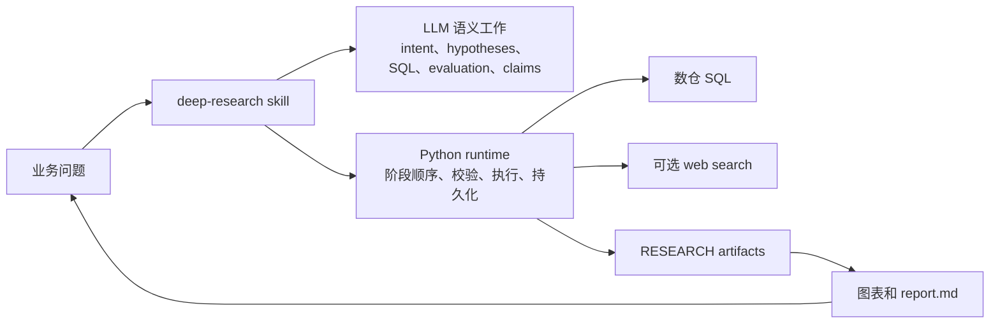
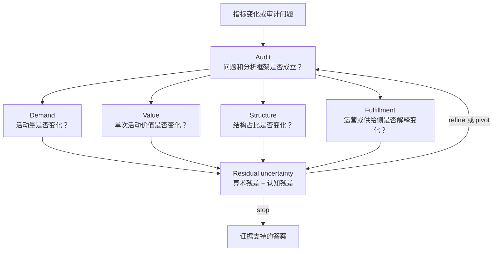
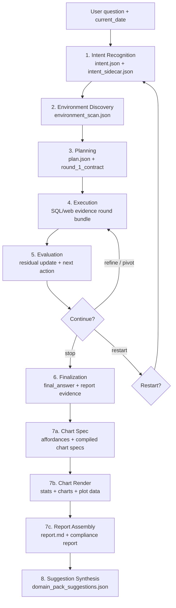
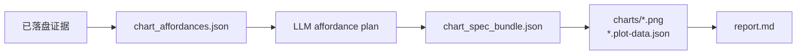

# Pandora：Deep Research Skill Family

[English](README.md)

Pandora 是一套以 contract 为中心的 LLM 业务研究运行时。它适合回答：

- 为什么某个指标变化了？
- 哪个分组对变化贡献最大？
- 这个运营趋势是真的，还是报表口径问题？
- 当前数仓和外部证据是否足够支撑一个可靠答案？

项目由用户侧 `deep-research` skill、严格的阶段 contract、Python runtime、
SQL/web 证据执行、可视化生成和可审计报告组装组成。



## Pandora 是什么

Pandora 将业务推理和运行时治理分开。

| 责任方 | 职责 |
| --- | --- |
| LLM / skill protocol | 业务语义、假设设计、SQL 编写、web search 问题、评估推理、最终结论。 |
| Runtime | 阶段顺序、contract 校验、SQL 与 web 执行、cache/admission 策略、artifact 落盘、lineage 校验、合规报告。 |
| Host application | 数仓 client factory、可选 web provider、模型 callbacks、报告策略、调度或产品集成。 |

Runtime 永远不会替模型选择表、join、filter、metric、hypothesis、图表语义或最终结论。它只执行和校验协议产出的显式 artifact。

## 为什么需要它

自由发挥式数据分析 agent 常见的问题很稳定：没验证指标就下 driver claim、静默改写 SQL、证据链丢失，或者把 partial evidence 说成确定结论。Pandora 用显式 contract 和已落盘证据约束这条工作流。



## 仓库地图

```text
Pandora-main/
  README.md
  README.zh-CN.md
  requirements.txt
  scripts/
    deep_research_runtime.py        # local agents 和 host 使用的桥接 CLI。
    example_sql_boundary_test.py    # Example 数仓边界测试脚本。
  runtime/
    contracts.py                    # 共享对象校验。
    session_state.py                # 阶段顺序和 continuation gates。
    session_orchestration.py         # 端到端 governed session helpers。
    orchestration.py                # Contract 执行和 finalization。
    tools.py                        # SQL 执行 helpers。
    web_search.py                   # provider-neutral web evidence lane。
    visualization.py                # 图表 affordances、渲染、报告组装。
    compliance.py                   # protocol trace、evidence graph、audit report。
    example_clients/                # Vendor HTTP、通用 HTTP、SQLAlchemy clients。
  skills/
    deep-research/SKILL.md          # 用户侧正式入口。
    intent-recognition/SKILL.md     # Stage 1。
    data-discovery/SKILL.md         # Stage 2。
    data-visualization/SKILL.md     # Stage 7。
  tests/
    test_visualization_affordances.py
    test_web_evidence_runtime.py
```

## 执行生命周期

协议是串行的。Stage 不能跳过、重排，也不能合并成自由发挥式回答。



### Stage 职责

| Stage | 角色 | 产出 |
| --- | --- | --- |
| 1. Intent Recognition | 将原始问题规范化成安全研究框架。 | `IntentRecognitionResult`、冻结的 `NormalizedIntent`、`pack_gaps`。 |
| 2. Environment Discovery | 检查 schema 和证据可用性，但不提升业务结论。 | `DataContextBundle`。 |
| 3. Planning | 构建 hypothesis board，并编写第一轮可执行 contract。 | `PlanBundle`、`round_1_contract`。 |
| 4. Execution | 只执行显式 `queries[]` 和 `web_searches[]`。 | SQL results、web results、recall assessments、execution log、round bundle。 |
| 5. Evaluation | 解释已落盘证据，并决定 `refine`、`pivot`、`stop` 或 `restart`。 | `RoundEvaluationResult`，需要继续时产出 continuation token。 |
| 6. Finalization | 合成 supported claims 和 report evidence。 | `FinalAnswer`、`ReportEvidenceBundle`、`ReportEvidenceIndex`。 |
| 7a. Chart Spec | Runtime 暴露 chart-ready affordances；LLM 只选择 affordance ids。 | `chart_affordances.json`、`chart_compile_report.json`、`chart_spec_bundle.json`。 |
| 7b. Chart Render | 基于显式 plot data 和 plot spec 渲染图表。 | `descriptive_stats.json`、`visualization_manifest.json`、`charts/*`。 |
| 7c. Report Assembly | 组装人类可读 markdown 报告。 | `report.md`、刷新后的 `compliance_report.json`。 |
| 8. Suggestion Synthesis | session 结束后 best-effort 生成 domain-pack 改进建议。 | 需要时写入 `domain_pack_suggestions.json`。 |

## 快速开始

Pandora 运行时主体主要依赖 Python 标准库。可选渲染和数仓依赖列在 `requirements.txt`。

```bash
python3 -m venv .venv
source .venv/bin/activate
python3 -m pip install -r requirements.txt
```

验证本地 runtime 绑定：

```bash
python3 scripts/deep_research_runtime.py doctor
```

查看 runtime capabilities：

```bash
python3 scripts/deep_research_runtime.py capabilities
```

创建 session shell：

```bash
python3 scripts/deep_research_runtime.py start-session \
  --slug demo_research \
  --raw-question "Why did weekly revenue decline?" \
  --current-date "2026-05-07" \
  --web-search-mode skip
```

之后由 host 或 local agent 通过桥接 CLI 逐阶段持久化 artifact：

```bash
python3 scripts/deep_research_runtime.py persist-intent \
  --slug demo_research \
  --session-id <session_id> \
  --input intent_result.json

python3 scripts/deep_research_runtime.py persist-discovery \
  --slug demo_research \
  --session-id <session_id> \
  --input discovery_bundle.json

python3 scripts/deep_research_runtime.py persist-plan \
  --slug demo_research \
  --session-id <session_id> \
  --input plan_bundle.json
```

`runtime/session_orchestration.py` 中的 `run_research_session(...)` 是 host integration API。它需要 host 提供 `produce_*` callbacks，不是一个独立的全自动 LLM runner。

## 连接数仓

CLI 只接受已注册 factory alias。这可以避免 LLM-authored content 传入任意 module path 或 filesystem path。

内置 aliases：

| Alias | 实现 |
| --- | --- |
| `vendor_http` | `runtime.example_clients.vendor_http_client:create_client` |
| `http` | `runtime.example_clients.http_sql_client:HttpSqlClient` |
| `sqlalchemy` | `runtime.example_clients.http_sql_client:SqlAlchemyClient` |

在 host 环境中注册可信自定义 factory：

```bash
export DEEP_RESEARCH_CLIENT_FACTORIES='{"warehouse":"my_package.clients:create_client"}'
```

然后通过 alias 执行 discovery 或 contract：

```bash
python3 scripts/deep_research_runtime.py probe-schema \
  --client-factory warehouse \
  --list-tables-sql "SHOW TABLES"
```

### Vendor HTTP 示例

```bash
export VENDOR_WAREHOUSE_BASE_URL="https://<warehouse-host>"
export VENDOR_WAREHOUSE_PATH="/<sql-endpoint>"
export VENDOR_WAREHOUSE_CHANNEL="<channel-or-app-id>"
export VENDOR_WAREHOUSE_SECRET="<request-signing-secret>"
export VENDOR_WAREHOUSE_QUERY_TIMEOUT="60"
export VENDOR_WAREHOUSE_MAX_ROWS="200000"
```

## Web Evidence Lane

Pandora 支持 SQL-only session，也支持 SQL/web 混合证据 session。

默认 web provider 是配置后的 Tavily：

```bash
export TAVILY_API_KEY="<secret>"
```

常用模式：

| Mode | 行为 |
| --- | --- |
| `auto` | 有 provider 时使用；没有时继续 SQL-only。 |
| `required` | 没有 web provider 时 preflight 失败。 |
| `skip` | 本次 session 禁用 web search。 |

Host 可以通过 `DEEP_RESEARCH_WEB_CLIENT_FACTORIES` 注册自定义 web client。

## 可视化与报告

Stage 7 是 governed 的，所以图表不能发明新分析。Runtime 先从已落盘证据生成 chart-ready affordances，LLM 选择 affordance ids，然后 runtime 编译并渲染显式 plot data。



常用桥接命令：

```bash
python3 scripts/deep_research_runtime.py prepare-chart-affordances \
  --slug demo_research \
  --session-id <session_id>

python3 scripts/deep_research_runtime.py compile-chart-spec \
  --slug demo_research \
  --session-id <session_id> \
  --input chart_affordance_plan.json

python3 scripts/deep_research_runtime.py render-charts \
  --slug demo_research \
  --session-id <session_id>

python3 scripts/deep_research_runtime.py assemble-report \
  --slug demo_research \
  --session-id <session_id>
```

Renderer capability 可以通过 `doctor` 或 `capabilities` 查看。当前 runtime 暴露 Matplotlib/Agg renderer，要求显式 plot data，并支持 line、bar、horizontal bar、scatter、area、histogram、box 和 heatmap。

## Artifacts

每个 session 都会将可审计 artifacts 写入：

```text
RESEARCH/<slug>/
  latest_session.json
  sessions/
    <session_id>/
      manifest.json
      session_state.json
      intent.json
      intent_sidecar.json
      environment_scan.json
      plan.json
      rounds/
        <generation_id>/
          <round_id>.json
      execution_log.json
      final_answer.json
      report_evidence.json
      report_evidence_index.json
      chart_affordances.json
      chart_compile_report.json
      chart_spec_bundle.json
      descriptive_stats.json
      visualization_manifest.json
      charts/*.plot-data.json
      charts/*.png
      report.md
      protocol_trace.json
      evidence_graph.json
      compliance_report.json
      domain_pack_suggestions.json
```

上层消费者需要完整持久化上下文时，可以使用 `load_session_evidence(slug)` 或桥接命令：

```bash
python3 scripts/deep_research_runtime.py session-evidence \
  --slug demo_research \
  --session-id <session_id>
```

## Domain Packs

Domain pack 是上下文定制层，用于补充词表和先验。它可以调优 metric aliases、dimensions、problem-type hints、hypothesis-family priors、operator preferences 和 performance-risk hints。

它不能替代 discovery，不能向 Stage 1 暴露物理 schema 捷径，也不能取消“可执行 SQL 必须由 LLM 显式编写”这条要求。

从这里开始：

- `skills/deep-research/domain-packs/DOMAIN_PACK_GUIDE.md`
- `skills/deep-research/domain-packs/generic/pack.json`

## Example SQL 安全说明

仓库包含 Example 数仓边界说明：

- `example_sql_boundary_report.md`
- `example_sql_writing_rules.md`
- `skills/deep-research/references/example-sql-rules.md`

当 session 触达 Example 数仓数据时，skill protocol 要求在 probe 或 execute SQL 之前读取 Example SQL rules。

高层规则：

- 只使用单条 `SELECT` 或 `WITH`。
- 探索样本必须添加 `LIMIT`。
- 事实表查询要按时间过滤，尤其是 `example_fact.event_time`。
- 避免无过滤高基数聚合、大排序、堆叠式 `COUNT(DISTINCT ...)`。
- Join 维表前先过滤或聚合事实表侧。

## 开发

运行测试：

```bash
python3 -m unittest discover -s tests -v
```

常用 smoke checks：

```bash
python3 scripts/deep_research_runtime.py doctor
python3 scripts/deep_research_runtime.py capabilities
```

当前测试覆盖 governed chart affordance 编译、text-only report fallback、web evidence 执行、recall refinement，以及 SQL/web lineage validation。

## 权威文档

| 文档 | 用途 |
| --- | --- |
| `skills/deep-research/SKILL.md` | 用户侧正式协议入口。 |
| `skills/deep-research/references/contracts.md` | 跨阶段对象唯一事实源。 |
| `skills/deep-research/references/core-methodology.md` | 五层方法论、residual 逻辑和 conclusion 纪律。 |
| `skills/intent-recognition/SKILL.md` | Stage 1 intent normalization。 |
| `skills/data-discovery/SKILL.md` | Stage 2 discovery。 |
| `skills/deep-research/sub-skills/hypothesis-engine.md` | Stage 3 planning。 |
| `skills/deep-research/sub-skills/investigation-evaluator.md` | Stage 5 evaluation。 |
| `skills/data-visualization/SKILL.md` | Stage 7 visualization 和 report packaging。 |

## 不可违反的规则

1. 完整 session 必须以 `deep-research` 作为入口。
2. 共享对象 shape 以 `contracts.md` 为唯一事实源。
3. Stage 2 开始后冻结 `NormalizedIntent`。
4. Stage 2 只做 discovery。
5. Round 1 必须 audit-first。
6. 只执行显式 `InvestigationContract.queries[]` 和 `web_searches[]`。
7. 只有最新 evaluation 识别出更好的下一步测试时，才能继续。
8. 矛盾和 residual uncertainty 必须保留。
9. 每个 supported final claim 都必须追溯到已落盘证据。
10. 不能用 visualization 或 report assembly 引入新 claim。
