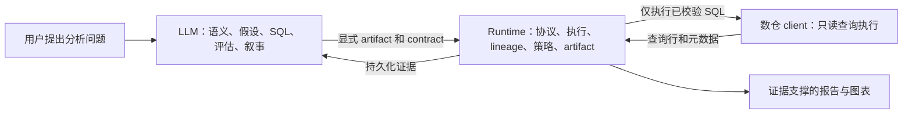
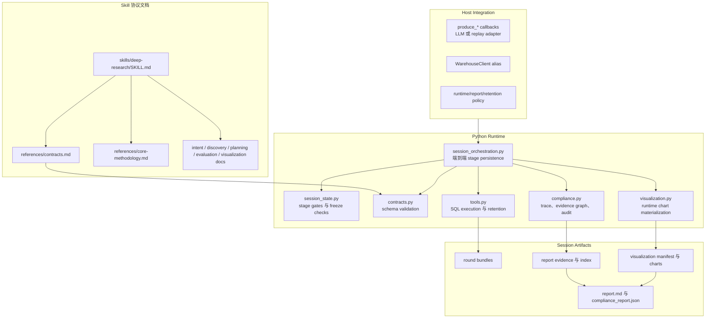
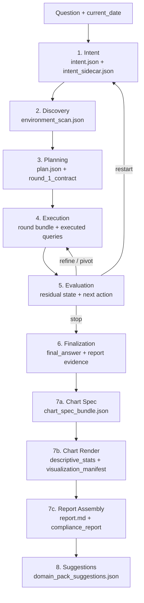
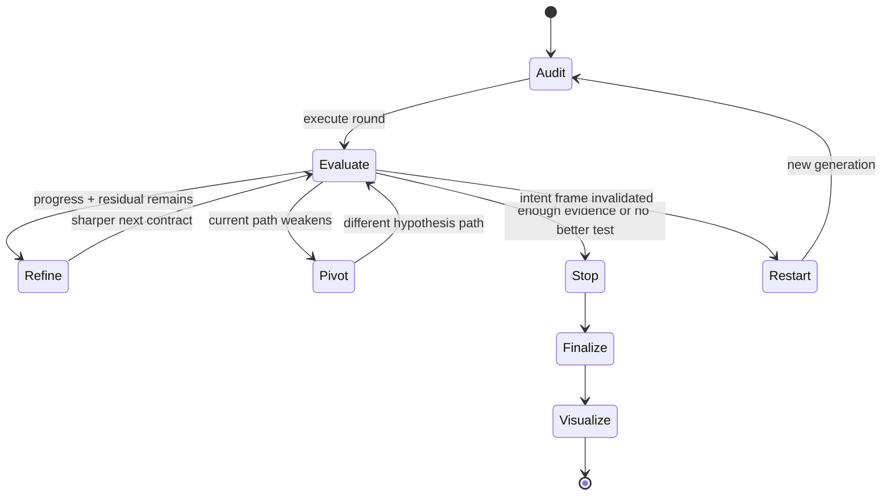
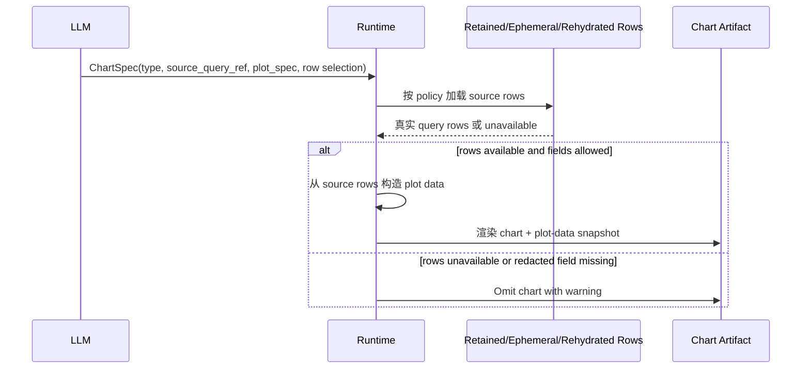
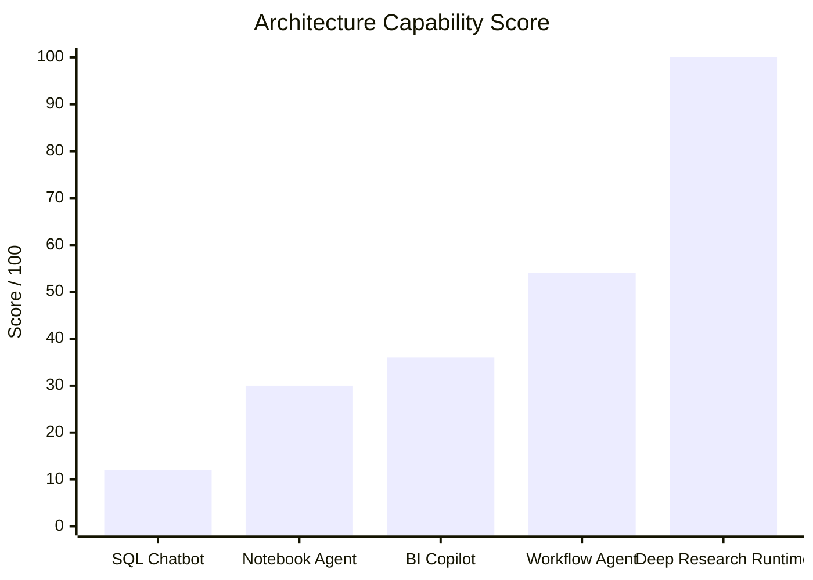
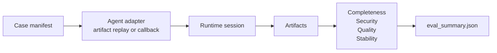

# Deep Research Runtime

一套 contract-first 的证据型数据分析运行时。

Deep Research Runtime 面向长流程分析型 agent：它适合回答“为什么某个指标变化了？”、“哪个分组驱动了变化？”、“这个趋势是不是真的？”这类需要多轮验证、证据闭环和最终报告交付的问题。

项目的核心分工很清楚：

- LLM 负责业务语义、假设设计、SQL 编写、评估推理、图表意图和最终结论。
- runtime 负责阶段顺序、contract 校验、SQL 执行、行级留存策略、artifact 落盘、lineage 校验、restart 处理、图表真实数据注入和合规产物。
- host 系统负责数仓凭据、client adapter、live mode 授权、留存策略、报告策略，以及可选的 LLM callback 接入。

这套设计让 deep research loop 可以基于证据继续、转向、停止或重启，同时保证每个结论和图表都能追溯到 runtime 持久化证据。

---

## 为什么需要它

很多数据 agent 容易走向两个极端：

1. 让 LLM 自由发挥 SQL、结论和图表，但缺少稳定审计链路。
2. 把太多分析规则写死在 runtime 里，迫使 LLM 适应不该硬编码的业务判断。

本项目选择第三条路：**runtime 对协议和证据严格，对业务判断保持中立**。



---

## 设计理念

Deep research 不是“多跑几条 SQL，直到答案看起来很自信”。它是一种闭环研究纪律。

| 原则 | Runtime 如何执行 | LLM 的自由度 |
| --- | --- | --- |
| 先验证 baseline，再提出 claim | Round 1 先验证分析框架是否成立，再提升驱动原因。 | LLM 仍然选择如何测试 baseline。 |
| 研究边界明确 | 每轮执行必须由显式 `InvestigationContract` 管住。 | LLM 编写 contract 和 SQL。 |
| 由 residual 驱动下一轮 | 继续必须有未解决问题和更好的下一步测试。 | LLM 决定 refine、pivot、stop 或 restart。 |
| 证据可追溯 | 最终 claim 和图表必须指向已落盘 query lineage。 | LLM 决定 claim 含义和解释方式。 |
| 局部降级优先 | 缺 rows、负载阻塞、图表不支持时只降级局部产物。 | 报告仍可带着诚实不确定性完成。 |
| Host policy 优先于硬编码 | 留存、语言、live access、敏感数据处理都可配置。 | LLM 不需要迎合隐藏 runtime 偏好。 |

---

## 系统架构



主要 runtime 入口：

- [`scripts/deep_research_runtime.py`](scripts/deep_research_runtime.py)：本地 agent 和脚本化 stage handoff 使用的 bridge CLI。
- [`runtime/session_orchestration.py`](runtime/session_orchestration.py)：`run_research_session(...)` host integration API。
- [`runtime/tools.py`](runtime/tools.py)：查询执行、rows preview、行级留存、脱敏和 ephemeral row 注册。
- [`runtime/visualization.py`](runtime/visualization.py)：图表数据 materialization、图表渲染和报告组装。
- [`scripts/run_project_eval.py`](scripts/run_project_eval.py)：项目级 eval harness，覆盖协议、流程完成度、安全、稳定性和质量。

---

## Deep Research 执行流程

协议是串行的。Stage 不能跳过、合并或被静默重写。



### 研究闭环

Deep research loop 由 residual uncertainty 驱动，而不是由“把轮次数用完”驱动。



Hypothesis 状态是显式的：`proposed`、`supported`、`weakened`、`rejected`、`not_tested`、`blocked_by_load`。`not_tested` 是证据状态，不是 runtime 硬阻断；只要最新 evaluation 授权了更好的证据路径，它就可以重新成为目标。`rejected` 默认仍然排除，除非未来设计显式 reopen 能力。

---

## 特色机制

| 机制 | 防止的问题 | 实现方式 |
| --- | --- | --- |
| Stage freeze + 幂等重放 | 下游消费到会移动的上游 artifact。 | 已完成 stage 可重放同 payload；不同 payload 改写冻结 artifact 会被阻断。 |
| Contract-locked execution | Runtime 替 LLM 发明或修补 SQL。 | Execution 只运行 `InvestigationContract.queries[]`。 |
| Continuation token | Round 2+ 变成原始 plan 的脚本化展开。 | 新轮次必须引用最新 evaluation、parent round、open question、intent hash 和 plan hash。 |
| Restart generation tracking | 被推翻的 intent frame 仍产出 final answer。 | Restart 记录 cause history、切换 generation，并阻断旧 frame finalization。 |
| 统一 rows retention | Preview 泄漏 result rows 已删除字段。 | `rows_preview` 和 `result_rows` 走同一套留存/脱敏策略。 |
| Ephemeral chart rows | 图表成功率依赖 full rows 落盘。 | 同进程执行可用临时 rows 产图，不把 full rows 写入 artifact。 |
| Runtime chart materialization | LLM payload 编造图表数值。 | LLM 只给图表语义和字段映射；runtime 从真实 query rows 取值。 |
| 局部图表降级 | 单个图表失败拖断整份报告。 | 缺数据或字段被 drop 时只 omitted 当前 chart，并记录 warning。 |
| 开放业务对象分类 | 窄 enum 迫使 LLM 错分业务对象。 | 支持常见 entity type，未知对象可用 `other` 保留原始 label。 |
| 项目级 eval harness | 修漏洞后流程完成率或质量下降。 | Mock/replay 和可选 live suite 评分完成度、稳定性、安全、lineage 和报告质量。 |

---

## 图表真实性模型

图表阶段故意拆成 LLM-authored semantics 和 runtime-owned data materialization。



LLM 可以为了兼容性提供 `plot_data.payload`，但其中的数值不参与渲染。如果 payload 与 runtime rows 不一致，runtime 记录 warning，并在 rows 可用时继续用真实 rows 渲染。

---

## Artifact 地图

每个 session 都会在 `RESEARCH/<slug>/sessions/<session_id>/` 下写入显式 artifacts。

```text
RESEARCH/<slug>/
  latest_session.json
  sessions/
    <session_id>/
      manifest.json
      session_state.json
      intent.json
      intent_sidecar.json
      environment_scan.json
      plan.json
      rounds/<generation_id>/<round_id>.json
      execution_log.json
      final_answer.json
      report_evidence.json
      report_evidence_index.json
      chart_spec_bundle.json
      descriptive_stats.json
      visualization_manifest.json
      charts/*.plot-data.json
      charts/*.png
      report.md
      protocol_trace.json
      evidence_graph.json
      compliance_report.json
      domain_pack_suggestions.json
```

核心不变量很简单：**final answer、chart 和 report 是对已落盘证据的包装，不是新增分析的位置。**

---

## 竞品形态对比

下面比较的是产品形态，不是具名厂商。分数来自本仓库的架构能力评分模型，不是公开市场 benchmark；如果要评估具体实现，应使用 `scripts/run_project_eval.py` 重新跑分。

评分尺度：

- 0 = 不具备
- 1 = 弱或主要靠人工
- 3 = 部分具备
- 5 = 一等机制

| 能力项 | SQL Chatbot | Notebook Agent | BI Copilot | Workflow Agent | Deep Research Runtime |
| --- | ---: | ---: | ---: | ---: | ---: |
| 显式 stage protocol | 1 | 2 | 2 | 3 | 5 |
| 冻结 artifact 纪律 | 0 | 1 | 1 | 3 | 5 |
| Contract-locked SQL execution | 1 | 2 | 2 | 3 | 5 |
| 多轮 residual logic | 1 | 2 | 1 | 3 | 5 |
| Restart 与 stop 区分 | 0 | 1 | 1 | 2 | 5 |
| Claim-to-query lineage | 1 | 2 | 3 | 3 | 5 |
| 图表数据真实性约束 | 0 | 1 | 2 | 2 | 5 |
| Row retention 与 redaction policy | 1 | 1 | 3 | 3 | 5 |
| 局部降级不阻断流程 | 1 | 2 | 2 | 3 | 5 |
| 项目级 eval harness | 0 | 1 | 1 | 2 | 5 |
| **总能力分 / 100** | **12** | **30** | **36** | **54** | **100** |



### 分数如何理解

| 项目形态 | 擅长点 | 常见短板 |
| --- | --- | --- |
| SQL Chatbot | 快速单查询探索。 | 闭环弱、lineage 弱，图表容易变成叙事装饰。 |
| Notebook Agent | 灵活分析和可检查代码单元。 | 状态通常是 notebook-local，不是 protocol-governed。 |
| BI Copilot | Dashboard 内摘要和指标查询。 | 通常依赖既有语义层，对不确定研究任务支持较弱。 |
| Workflow Agent | 工具编排和任务自动化。 | 可以串步骤，但不一定强制分析证据纪律。 |
| Deep Research Runtime | 证据型多轮研究、审计 artifact 和报告交付。 | 需要显式 callbacks、contracts、policies 和 host integration。 |

---

## Evaluation Model

项目级 eval harness 不只检查单个漏洞，而是检查完整研究任务能否安全完成并产出有用 artifact。



默认评分权重：

| 维度 | 权重 |
| --- | ---: |
| Protocol compliance | 20 |
| Intent and scope correctness | 12 |
| SQL and evidence quality | 18 |
| Business conclusion accuracy | 22 |
| Residual and uncertainty discipline | 10 |
| Lineage and artifact integrity | 10 |
| Report and visualization usefulness | 8 |

运行 deterministic mock suite：

```bash
python3 scripts/run_project_eval.py --suite mock --agent artifact_replay
```

可选 live suite 默认关闭，必须显式加 flag 并通过环境变量注入凭据。凭据不能提交到仓库，也不能写入 artifact。

```bash
python3 scripts/run_project_eval.py \
  --suite example_retail \
  --live-example-retail \
  --agent callback \
  --case example_retail_audit_004
```

---

## Quick Start

检查 runtime wiring：

```bash
python3 scripts/deep_research_runtime.py doctor
```

查看 runtime capabilities：

```bash
python3 scripts/deep_research_runtime.py capabilities
```

创建 session root：

```bash
python3 scripts/deep_research_runtime.py start-session \
  --slug demo-analysis \
  --question "Why did the example metric change this month?" \
  --current-date 2026-05-01
```

运行编译和 smoke checks：

```bash
python3 -m py_compile runtime/*.py runtime/example_clients/*.py \
  scripts/deep_research_runtime.py scripts/run_project_eval.py
python3 scripts/run_project_eval.py --suite mock --agent artifact_replay
```

`run_research_session(...)` 是 host integration API，需要外部提供 `produce_*` callbacks；本仓库不内置独立 LLM runner。

---

## Host Integration

实现一个 `WarehouseClient`，并通过 factory alias 注册。runtime 接受 alias，不接受 LLM 编写的文件系统路径。

```bash
export DEEP_RESEARCH_CLIENT_FACTORIES='{"warehouse":"package.module:create_client"}'
```

示例签名 HTTP client 配置：

```bash
export VENDOR_WAREHOUSE_BASE_URL="https://<warehouse-host>"
export VENDOR_WAREHOUSE_PATH="/<sql-endpoint>"
export VENDOR_WAREHOUSE_CHANNEL="<channel-or-app-id>"
export VENDOR_WAREHOUSE_SECRET="<request-signing-secret>"
```

通过 bridge 做 schema probe：

```bash
python3 scripts/deep_research_runtime.py probe-schema \
  --client-factory warehouse \
  --list-tables-sql "SHOW TABLES"
```

---

## Security And Governance

安全是项目级行为，不是最终报告前临时加的一层检查。

| 区域 | Runtime 行为 |
| --- | --- |
| SQL execution | 只执行显式 contract queries，并先经过 safety/admission checks。 |
| Destructive SQL | eval security scan 将其视为 hard failure。 |
| Credentials | 由 host environment 注入，并在 eval artifacts 中扫描泄漏。 |
| Row retention | 默认 preview-only，除非 host policy 授权保留。 |
| Redaction | Preview 和 result rows 共用同一条留存/脱敏路径。 |
| Charts | 只能来自 retained、ephemeral 或显式 rehydrated runtime rows。 |
| Restart | 新 valid intent generation 建立前阻断 finalization。 |
| Frozen artifacts | 同 payload replay 允许，mutation 阻断。 |

---

## Domain Packs

Domain pack 是上下文定制层。它可以调优词汇、problem-type priors、unsupported-dimension hints、operator preferences 和 performance-risk hints。

它不能：

- 替代 discovery
- 给 Stage 1 提供物理 schema 捷径
- 放宽 SQL safety
- 绕过 evidence lineage
- 强迫 LLM 把业务对象归入不准确类别

Pack schema 和 consumer matrix 见 [`skills/deep-research/domain-packs/DOMAIN_PACK_GUIDE.md`](skills/deep-research/domain-packs/DOMAIN_PACK_GUIDE.md)。

---

## 权威文档

- [`skills/deep-research/SKILL.md`](skills/deep-research/SKILL.md)：用户侧正式协议入口。
- [`skills/deep-research/references/contracts.md`](skills/deep-research/references/contracts.md)：共享对象唯一事实源。
- [`skills/deep-research/references/core-methodology.md`](skills/deep-research/references/core-methodology.md)：residual 逻辑、round 策略和 conclusion 纪律。
- [`skills/intent-recognition/SKILL.md`](skills/intent-recognition/SKILL.md)：Stage 1 intent normalization。
- [`skills/data-discovery/SKILL.md`](skills/data-discovery/SKILL.md)：Stage 2 environment discovery。
- [`skills/deep-research/sub-skills/hypothesis-engine.md`](skills/deep-research/sub-skills/hypothesis-engine.md)：Stage 3 planning。
- [`skills/deep-research/sub-skills/investigation-evaluator.md`](skills/deep-research/sub-skills/investigation-evaluator.md)：Stage 5 evaluation。
- [`skills/data-visualization/SKILL.md`](skills/data-visualization/SKILL.md)：Stage 7 visualization and reporting。

---

## 不可违反的规则

1. 完整 session 必须以 `deep-research` 作为入口。
2. 共享对象 shape 以 `contracts.md` 为唯一事实源。
3. 下游消费后，上游 artifact 必须冻结。
4. Discovery 不能混入原因 claim。
5. Round 1 必须 audit-first。
6. 只执行显式 `InvestigationContract.queries[]`。
7. 只有最新 evaluation 识别出更好的下一步测试时，才能继续。
8. 矛盾和 residual uncertainty 必须保留。
9. 每个 supported final claim 都必须追溯到已落盘证据。
10. Visualization 和 report assembly 只能包装证据，不能新增分析。
